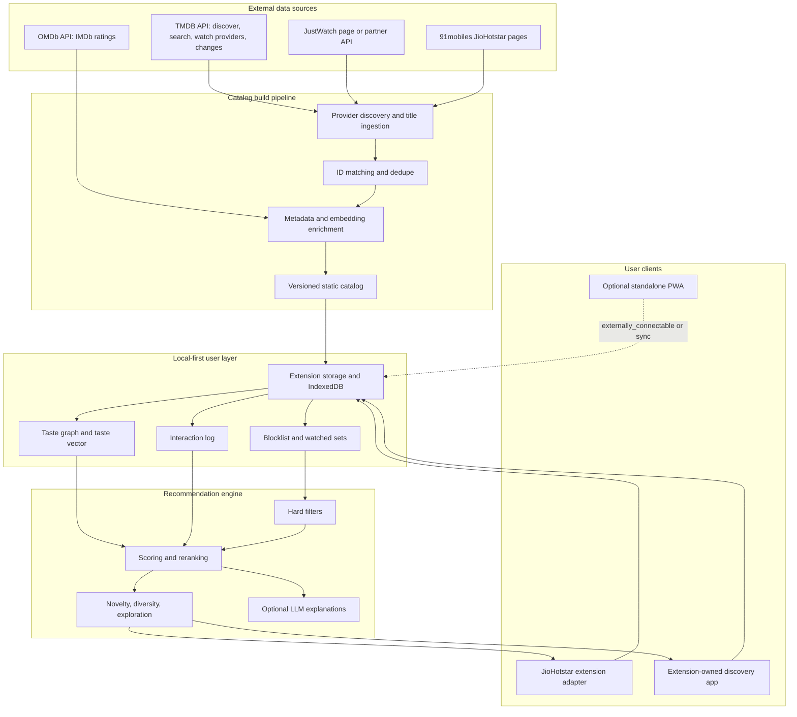

# Revised Architecture Blueprint: Personal JioHotstar Curator

Date: 2026-06-24

This document is the corrected architecture synthesis after reading:

- `Docs/report.md` and `Docs/report (1).md` (identical files)
- `initial ideas/PLAN 1,2,3.docx`
- `initial ideas/PLAN 4.docx`
- `initial ideas/5.pdf`
- `Docs/architecture_diagram.png`
- `Docs/comparison_analysis.png`

The short verdict: the original hybrid idea is right, but the build should be simpler, more local-first, and more careful about Chrome extension/network limits. The strongest architecture is not "build a giant AI platform around JioHotstar." It is:

> A local-first browser extension plus an extension-owned discovery app, backed by a versioned external catalog and a deterministic recommender that uses explicit user controls before any AI ranking.

## 1. Product Objective

The system should solve four user problems:

1. Permanently hide unwanted movies/shows from the JioHotstar web homepage.
2. Stop already-watched content from being recommended again.
3. Give the user a swipe-style discovery interface for fast preference capture.
4. Generate better recommendations using personal taste, mood, quality, novelty, and diversity.

The system must not:

1. Bypass JioHotstar login, DRM, subscriptions, or video playback.
2. Replay private/internal JioHotstar APIs as a product dependency.
3. Store or transmit JioHotstar credentials, cookies, tokens, or video URLs.
4. Depend on brittle CSS class selectors as the only way to identify content.

## 2. Key Corrections To The Current Report

| Current report claim | Correction | Why |
| --- | --- | --- |
| Use `MutationObserver` plus DOM selectors as the main content detector | Use a layered content adapter: URL anchors, semantic text, data attributes, image alt text, visible cards, and optional page-world metadata observation only as a dev feature | CSS classes and DOM shape will break often. MV3 network APIs also cannot simply read response JSON bodies. |
| Use Chrome `webRequest` or `declarativeNetRequest` to intercept raw BFF JSON | Do not treat this as a core feature. `declarativeNetRequest` does not view response content; `webRequest` observes traffic but is not a clean response-body parser in MV3. Page-world fetch/XHR instrumentation is possible but legally and operationally riskier | Chrome docs say DNR modifies requests without viewing content. MV3 also removed blocking `webRequest` for most extensions. |
| 91mobiles as primary catalog source | TMDB watch-provider discovery should be primary; 91mobiles should be a secondary validator and metadata supplement | 91mobiles is useful but unstable as a dependency. The live page currently exposes 4,317 movie and 1,682 show counts, but it is still a third-party webpage, not a stable API. |
| Hardcode TMDB limit as 40 requests per 10 seconds | Update rate limit model: legacy 40/10s was disabled. TMDB now says upper limits are around 40 requests per second and may change; respect 429 | The old number appears in the reports but is no longer current. |
| Train a TensorFlow.js two-tower model every 10 swipes | Start with embeddings, taste graph, temporal decay, diversity, and a lightweight online model. Defer two-tower until enough data exists | A single-user system with 50-100 swipes is too small for a useful two-tower model. |
| Put Redis and FastAPI in the default architecture | Make backend optional. V1 can run with extension storage, IndexedDB, and a static catalog | Redis is solving a scale problem the MVP does not have. |
| LangGraph agent as core recommender | Use LLM/agent only on demand: natural-language search, explanations, taste summary, and mood parsing | The deterministic ranking path must be fast, testable, and offline-capable. |
| DIAL/Smart TV launch as core deep-link layer | Treat TV launch as a later experimental bridge | DIAL requires same-network device support and usually app-specific first-screen/second-screen cooperation. It is not guaranteed for JioHotstar. |

## 3. Target Architecture



## 4. Client Strategy

### 4.1 V1 Client: Browser Extension

The extension should be the first build because it directly solves the homepage clutter problem.

Core extension surfaces:

- Content script on `hotstar.com` / `jiohotstar.com` domains.
- Background service worker for storage, catalog updates, and API calls.
- Popup for quick settings.
- Side panel or full extension tab for the richer discovery UI.

Why side panel/full extension tab matters:

- A standalone web PWA and an extension do not automatically share IndexedDB or localStorage.
- If the discovery app ships first as an extension page, it can share extension storage cleanly.
- Later, a hosted PWA can communicate with the extension using `externally_connectable`, or use optional encrypted cloud sync.

### 4.2 JioHotstar Page Adapter

The adapter should not rely on a single selector strategy. It should use a layered extractor:

1. Anchor extractor: find links whose `href` contains stable content routes such as `/movies/`, `/shows/`, `/watch/`, or equivalent JioHotstar paths.
2. Text extractor: normalize visible card title text.
3. Image extractor: use poster `alt`, `aria-label`, and nearby text.
4. Data attribute extractor: use `data-*` attributes only if present and stable.
5. Parent card resolver: walk upward from a matched anchor/poster/title to the smallest repeated card or rail item.
6. Local catalog matcher: exact content ID first, then canonical URL, then normalized title+year, then fuzzy match.

Optional advanced adapter:

- A page-world script injected at `document_start` can instrument `fetch` and XHR to observe JSON metadata that the page itself receives.
- This must be dev/off by default, must never store headers/cookies/tokens, and must not replay internal endpoints.
- This is not a replacement for the rendered-page adapter.

Important Chrome constraint:

- `declarativeNetRequest` can block or modify network requests without letting the extension inspect response bodies.
- `webRequest` is useful for observing/analyzing traffic, but MV3 removed `webRequestBlocking` for most non-policy extensions.
- Therefore, "intercept the raw BFF JSON with DNR/webRequest" is not a reliable product architecture.

### 4.3 On-Page Actions

The extension should start with a conservative UI:

- Hide button: "Never show again".
- Watched button.
- Watch later button.
- Undo toast.
- Optional IMDb/TMDB rating badge.
- Optional "why hidden" debug tooltip.

Do not start with a heavy swipe overlay on every JioHotstar card. That will create layout bugs and selector fragility. Put the rich swipe deck inside the extension app first.

## 5. Discovery App Strategy

### V1: Extension-Owned App

Build `chrome-extension://.../app.html` as the main discovery app.

Views:

- Swipe deck
- Dense discovery grid
- Hidden items
- Watched history
- Watch later
- Taste controls
- Catalog health/debug page

Advantages:

- Shares storage with extension.
- Works without a backend.
- Avoids cross-origin local storage problems.
- Can be packaged and tested together with the extension.

### V2: Standalone PWA

The hosted PWA is still useful, but it should come after the extension-owned app.

Sync options:

1. Extension bridge using `externally_connectable` from a trusted PWA origin.
2. Manual import/export of encrypted JSON.
3. Optional cloud sync with end-to-end encrypted user profile.
4. Local companion service for power users.

Do not assume the PWA can directly read extension IndexedDB.

## 6. Catalog Architecture

### 6.1 Source Priority

Primary:

- TMDB discover/search/watch-provider APIs.
- Resolve JioHotstar provider IDs from TMDB provider lists rather than hardcoding.
- Use `watch_region=IN` and provider filters for movies and TV.

Secondary:

- JustWatch public provider page for manual/automated validation.
- JustWatch Partner API only if legitimate access is available.

Tertiary:

- 91mobiles JioHotstar pages for counts, seed data, cross-checking, language/genre labels, and missing titles.
- OMDb for IMDb rating enrichment.

Avoid:

- Private JioHotstar APIs.
- Scraping authenticated pages at scale.
- Commercial "JioHotstar scraping API" dependencies unless legally reviewed.

### 6.2 Catalog Pipeline

Pipeline stages:

1. Provider discovery: fetch TMDB provider catalogs for India.
2. Seed ingestion: collect JioHotstar titles from TMDB discover results.
3. Cross-check: compare with 91mobiles and JustWatch provider pages.
4. ID match: map TMDB ID, IMDb ID, JioHotstar URL, 91mobiles URL, title/year/language.
5. Enrich: cast, director, genres, keywords, runtime, language, ratings, poster, overview.
6. Embed: precompute content embeddings from title, overview, genres, cast, director, mood tags, and language.
7. Confidence score: mark each title as high/medium/low availability confidence.
8. Publish: write a versioned catalog artifact.

Recommended artifact format:

- `catalog.json.gz` for simple static hosting.
- Optional `catalog.sqlite` later for faster local querying.
- Include `catalog_version`, `generated_at`, and source provenance per item.

### 6.3 91mobiles Scraping Rule

Do not crawl thousands of detail pages every week.

Better approach:

- Read list/filter pages first.
- Diff title URLs against the last snapshot.
- Only fetch new/changed detail pages.
- Respect robots.txt, 429s, cache headers, and long delays.
- Run a full audit monthly, not weekly.

The live 91mobiles page currently reports:

- Movies: 4,317
- Shows: 1,682
- Stream: 4,317

That makes it useful as a validation source, not as the single source of truth.

## 7. Local Data Model

### 7.1 Storage Choices

Use IndexedDB through Dexie for:

- Catalog
- Embeddings
- User interactions
- Watch history
- Watch later
- Hidden items
- Taste graph

Use `chrome.storage.local` for:

- Settings
- A small blocklist snapshot for fast boot
- Catalog version
- Feature flags

Use `chrome.storage.sync` only for tiny settings, not catalog or full user history. Its quota is small compared with local storage.

### 7.2 Core Tables

`catalog_items`

| Field | Purpose |
| --- | --- |
| `content_id` | Internal stable ID |
| `tmdb_id` | TMDB movie/TV ID |
| `imdb_id` | IMDb ID if known |
| `jiohotstar_url` | Verified playback/details URL if available |
| `title`, `original_title`, `year` | Matching and display |
| `type` | movie, show, episode, special |
| `language`, `region` | India catalog handling |
| `genres`, `keywords`, `moods` | Recommendation features |
| `cast`, `directors`, `creators` | Taste graph |
| `runtime_minutes` | Time-aware recommendations |
| `ratings` | IMDb/TMDB/other |
| `availability_confidence` | high, medium, low |
| `embedding` | Precomputed vector |
| `source_provenance` | TMDB, 91mobiles, JustWatch, OMDb |

`user_actions`

| Field | Purpose |
| --- | --- |
| `action_id` | Event ID |
| `content_id` | Target item |
| `action_type` | like, dislike, block, watched, watch_later, skipped, unblocked |
| `strength` | Soft dislike vs permanent block |
| `reason` | Optional user reason |
| `context` | homepage, swipe_deck, search, mood, extension_card |
| `created_at` | Event time |

`user_item_state`

| Field | Purpose |
| --- | --- |
| `content_id` | Target item |
| `hidden_state` | none, soft_hidden, blocked |
| `watch_state` | unseen, sampled, abandoned, watched, rewatch_ok |
| `watch_later` | Boolean |
| `last_shown_at` | Cooldown |
| `last_action_at` | Conflict resolution |

`taste_graph_edges`

| Field | Purpose |
| --- | --- |
| `source_type` | user, content, actor, director, genre, mood, language, franchise |
| `source_id` | Source node |
| `target_type` | Target node type |
| `target_id` | Target node |
| `weight` | Positive/negative preference |
| `updated_at` | Temporal decay |

## 8. Recommendation Engine

### 8.1 Ranking Pipeline

The ranking path must be deterministic before it is intelligent.

```text
Candidate catalog
-> availability filter
-> hard filters: blocked, watched, unsafe, already shown cooldown
-> mood/time filters
-> relevance scoring
-> diversity and novelty rerank
-> exploration injection
-> explanation generation only when needed
```

### 8.2 Hard Filters

Hard filters always win:

- Blocked content is never shown.
- Watched content is hidden from the main feed unless rewatch mode is on.
- Recently shown content gets a cooldown.
- Low confidence availability can be hidden unless the user enables "include uncertain".

This is more important than any neural model.

### 8.3 V1 Scoring Formula

Start with a transparent weighted score:

```text
score =
  0.35 * embedding_relevance
+ 0.20 * taste_graph_match
+ 0.15 * quality_signal
+ 0.10 * mood_fit
+ 0.08 * novelty
+ 0.07 * diversity
+ 0.05 * freshness
- penalties
```

Penalties:

- Strong negative actor/director/theme match.
- Similar to recently blocked item.
- Too close to recently shown item.
- Runtime mismatch with current time budget.
- Low availability confidence.

This is easy to debug and likely better than a premature neural network.

### 8.4 Taste Graph

The taste graph should be a first-class feature.

Track positive and negative weights for:

- Actors
- Directors/creators
- Genres
- Languages
- Franchises
- Themes
- Moods
- Runtime buckets
- Release decade
- Country/region
- Content type

Example:

```text
Like: "Kahaani"
-> boosts: thriller, mystery, strong female lead, Hindi, Sujoy Ghosh, Vidya Balan

Block: "Black Phone 2"
-> penalizes: supernatural horror, teen horror, Ethan Hawke if repeated blocks support it
```

Do not over-propagate from one action. Propagation should require either:

- Multiple related actions, or
- User confirmation such as "block this franchise" or "less like this actor".

### 8.5 Temporal Decay

Recent actions should matter more.

Suggested weights:

```text
0-7 days:     1.00
8-30 days:    0.80
31-180 days:  0.55
180+ days:    0.35
```

Permanent blocks do not decay unless the user changes them.

### 8.6 Diversity

The final feed should avoid repetitive rails.

Rules:

- No more than 30% same primary genre in a feed.
- No more than 2 items from same director per session.
- No more than 3 items with same lead actor per session.
- Always include at least one high-confidence item outside the user's top genre cluster if exploration is enabled.

### 8.7 Exploration

Use simple exploration before reinforcement learning.

Modes:

- Comfort: 5% exploration
- Balanced: 15% exploration
- Surprise: 35% exploration

Exploration should still respect quality and hard filters. "Random" should mean "not your usual cluster but still likely worth watching."

### 8.8 Neural Model Roadmap

Do not start with a browser-trained two-tower model.

Better progression:

V1:

- Embedding centroid
- Taste graph
- Transparent scoring
- Diversity rerank

V2:

- Logistic regression or small online classifier using features:
  - embedding similarity
  - genre/language/director/actor weights
  - runtime
  - rating
  - freshness
  - mood fit

V3:

- Small MLP if there are hundreds of labeled actions.

V4:

- Two-tower model only if:
  - there are 500+ meaningful interactions, or
  - the system becomes multi-user, or
  - you import watch/rating history from Trakt/Letterboxd/IMDb.

## 9. Agentic AI Layer

The agent should not be in the hot path for every recommendation.

Good uses:

- Natural language search: "show me a 90-minute Hindi thriller with no horror".
- Taste summary: "you seem to like grounded crime thrillers and dislike supernatural horror".
- Explanation: "why this title?"
- Query-to-filter parsing.
- Session planning: "I have 90 minutes and want comfort".
- Block reason clustering: identify recurring negative patterns.

Bad uses:

- Reranking every feed refresh.
- Deciding hard filters.
- Running a multi-node graph before basic ranking works.

Recommended design:

```text
User prompt
-> LLM parses intent into structured filters
-> deterministic retrieval and ranking
-> LLM explains top 5 only
```

LangGraph is useful later if the agent needs stateful multi-step behavior, but the early product should use a simpler function-calling or JSON-schema pipeline.

## 10. Deep Linking and Playback

Playback must stay inside official JioHotstar surfaces.

Rules:

- Store canonical JioHotstar URLs when available.
- Prefer opening the normal web URL.
- On iOS and Android, first try universal/app links through normal HTTPS URLs.
- Use Android `intent://` links only after testing the exact installed package and URL shape.
- If deep link fails, fall back to the title details page or search URL.

Do not:

- Proxy streams.
- Embed the player in your own app.
- Capture cookies or tokens.
- Generate playback URLs from private endpoints.

Smart TV:

- DIAL is real, but it is not a guaranteed JioHotstar integration path.
- Add TV launch later through a companion Android app, platform cast APIs, or user-tested deep-link recipes.
- Keep it out of the MVP.

## 11. Backend Strategy

### V1: No Backend

The MVP can be:

- Chrome extension
- Extension-owned app
- IndexedDB
- Static `catalog.json.gz`
- Optional OMDb/TMDB calls through the extension service worker

This is enough to validate the product.

### V2: Static Catalog Builder

Add a GitHub Actions or local scheduled job:

- Pull TMDB provider data.
- Enrich with OMDb.
- Diff with 91mobiles/JustWatch.
- Generate catalog artifact.
- Publish to GitHub Releases, Cloudflare R2, or a static host.

### V3: Optional Sync API

Add backend only for:

- Cross-device sync
- Hosted PWA storage bridge
- Remote catalog health checks
- Multi-user experiments

Preferred stack:

- FastAPI or Node only if needed.
- SQLite for personal deployment.
- Postgres plus pgvector if hosted/multi-user.
- Redis only if multi-user realtime sync becomes necessary.

## 12. Build Roadmap

### Phase 0: Validation Spikes, 3-5 days

Deliverables:

- Inspect current JioHotstar DOM and URL patterns manually.
- Save 20-30 HTML/card snapshots for adapter tests.
- Verify at least 20 content links open correctly.
- Verify TMDB provider discovery for JioHotstar in region IN.
- Confirm 91mobiles list pagination/detail behavior.

Exit criteria:

- At least 80% of visible homepage cards can be matched to a normalized title or URL.
- Deep link opens official JioHotstar page without custom auth handling.

### Phase 1: Core Extension Blocking, 1-2 weeks

Deliverables:

- MV3 extension skeleton.
- Content adapter.
- Permanent hide action.
- Watched action.
- Local IndexedDB + storage.local block snapshot.
- Undo.
- Hidden items management page.
- Adapter snapshot tests.

Exit criteria:

- Blocked items stay hidden after refresh and infinite scroll.
- No noticeable page slowdown.
- No internal API replay or credential capture.

### Phase 2: Catalog and Metadata, 1-2 weeks

Deliverables:

- TMDB-first catalog builder.
- OMDb rating enrichment.
- 91mobiles cross-check.
- Versioned static catalog.
- Local import/update logic.
- Basic rating badges.

Exit criteria:

- 1,000+ high-confidence titles imported.
- 90%+ of matched visible cards get metadata.

### Phase 3: Extension-Owned Discovery App, 2-3 weeks

Deliverables:

- Full-page extension app.
- Swipe deck.
- Discovery grid.
- Watch later.
- Watched diary.
- Hidden items.
- Taste controls.

Exit criteria:

- User can curate without opening JioHotstar.
- All actions immediately affect extension filtering.

### Phase 4: Recommendation V1, 2 weeks

Deliverables:

- Embedding-based relevance.
- Taste graph.
- Temporal decay.
- Diversity rerank.
- Exploration modes.
- Debug panel showing why each item ranked.

Exit criteria:

- Recommendations visibly change after 20-50 actions.
- Feed avoids blocked/watched/recent items.
- User can understand and correct wrong assumptions.

### Phase 5: Optional PWA and Sync, 2-4 weeks

Deliverables:

- Hosted PWA.
- `externally_connectable` bridge or encrypted sync.
- Import/export profile.
- Conflict resolution.

Exit criteria:

- PWA and extension remain consistent across actions.

### Phase 6: Agentic AI, 2-4 weeks

Deliverables:

- Natural language query parser.
- Mood and time-budget search.
- "Why this?" explanations.
- Taste summary.
- Local or cloud LLM toggle.

Exit criteria:

- LLM never decides hard filters.
- LLM output is grounded in catalog/user data.
- Product still works with AI disabled.

### Phase 7: Advanced ML and Multi-Platform, later

Deliverables:

- Lightweight classifier.
- Optional MLP/two-tower if enough data exists.
- Netflix/Prime/SonyLiv adapters.
- TV/cast experiments.

## 13. Risk Register

| Risk | Severity | Mitigation |
| --- | --- | --- |
| JioHotstar DOM changes | High | Multi-extractor adapter, snapshot tests, avoid CSS classes, graceful fallback |
| Internal API/ToS risk | High | No replay, no credentials, no private endpoint dependency, metadata-only operation |
| Catalog stale or wrong | High | Source confidence, link health checks, TMDB + 91mobiles + JustWatch cross-check |
| PWA/extension storage split | Medium | Extension-owned app first, bridge/sync later |
| LLM hallucination | Medium | LLM only explains/parses; deterministic retrieval/ranking owns results |
| Bad recommendation loops | Medium | Diversity, exploration, temporal decay, negative feedback |
| Too much infrastructure | Medium | No backend until sync/multi-device requires it |
| Smart TV handoff unreliable | Medium | Keep as later experiment |
| Privacy leakage | High | Local-first storage, no tokens, no watch data to third parties by default |

## 14. What To Keep From The Original Plans

Keep:

- Hybrid extension plus independent discovery interface.
- Local-first privacy.
- External metadata enrichment.
- Deep-link-only playback.
- Swipe feedback.
- Hard blocklist and watched exclusion.
- Embeddings for immediate cold-start value.
- Exploration and diversity.
- Mood/time inputs.
- Taste insights.

Change:

- Make the discovery app extension-owned first.
- Make TMDB primary, 91mobiles secondary.
- Replace heavy two-tower-first thinking with transparent V1 scoring.
- Replace LangGraph-first architecture with on-demand AI.
- Replace Redis/FastAPI default with no-backend V1.
- Replace "BFF JSON interception" with layered page adapters plus optional dev-only observation.

Remove from MVP:

- Redis.
- pgvector.
- ChromaDB.
- LangGraph.
- Ollama.
- Two-tower model.
- DIAL.
- Multi-platform support.

These are not bad technologies. They are just not first moves.

## 15. Recommended MVP Definition

The MVP should be named something like "JioHotstar Curator" and should do only this:

1. Let me click "Never show again" on a JioHotstar card.
2. Hide that title forever across refreshes and infinite scroll.
3. Let me mark a title as watched.
4. Show a local hidden/watched management page.
5. Import a static catalog and add basic IMDb/TMDB metadata.
6. Provide a simple extension app where I can swipe through catalog items.
7. Use transparent scoring to recommend unseen, unblocked content.

If this works, the project is real. Everything else is compounding value.

## 16. Research Notes

Current external facts checked on 2026-06-24:

- TMDB docs say the legacy 40 requests per 10 seconds API limit was disabled in 2019; current upper limits are around 40 requests per second and can change, so clients must respect 429 responses: https://developer.themoviedb.org/docs/rate-limiting
- TMDB supports discover filters such as `watch_region` and `with_watch_providers`: https://developer.themoviedb.org/reference/discover-movie
- TMDB has watch-provider endpoints for movies: https://developer.themoviedb.org/reference/movie-watch-providers
- TMDB documents search/discover/find workflows and external-ID lookup: https://developer.themoviedb.org/docs/finding-data
- TMDB daily ID exports and change tracking can help incremental updates: https://developer.themoviedb.org/docs/daily-id-exports and https://developer.themoviedb.org/docs/tracking-content-changes
- OMDb's free API key page lists a 1,000 daily limit: https://www.omdbapi.com/apikey.aspx
- Chrome `declarativeNetRequest` blocks or modifies requests without extensions viewing content: https://developer.chrome.com/docs/extensions/reference/api/declarativeNetRequest
- Chrome MV3 removed `webRequestBlocking` for most extensions: https://developer.chrome.com/docs/extensions/reference/api/webRequest
- Chrome content scripts default to isolated worlds; `MAIN` world is possible but riskier: https://developer.chrome.com/docs/extensions/reference/manifest/content-scripts
- Chrome extension storage local quota is 10 MB by default; `sync` is about 100 KB: https://developer.chrome.com/docs/extensions/reference/api/storage
- Chrome `externally_connectable` lets trusted web pages connect to an extension: https://developer.chrome.com/docs/extensions/reference/manifest/externally-connectable
- 91mobiles current JioHotstar page reports 4,317 movies and 1,682 shows: https://www.91mobiles.com/entertainment/best-jiohotstar-movies
- DIAL is a local-network discovery and launch protocol, not a guaranteed streaming-control API: https://www.dial-multiscreen.org/
- Existing extension precedent exists for OTT rating overlays/filtering, such as Sift and Rating-Finder: https://chromewebstore.google.com/detail/sift-imdb-ratings-on-vari/pfnhkljamlclkackkndllofcfhihacna and https://chromewebstore.google.com/detail/rating-finder-for-netflix/jgdlcjmbihmlmoljoilnennfbfeledem

