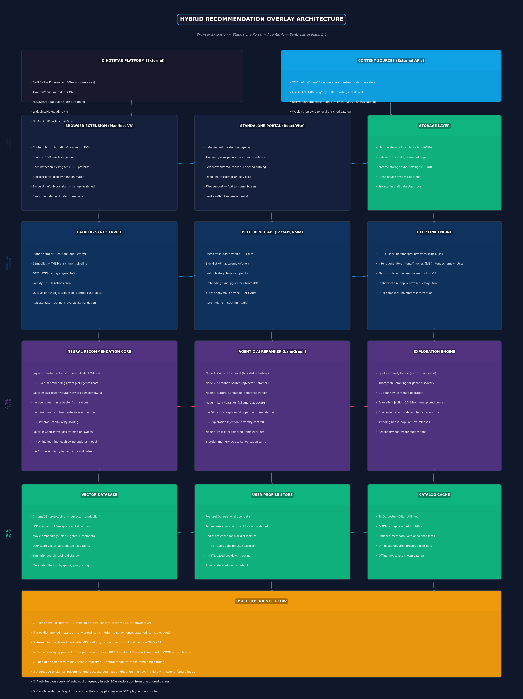
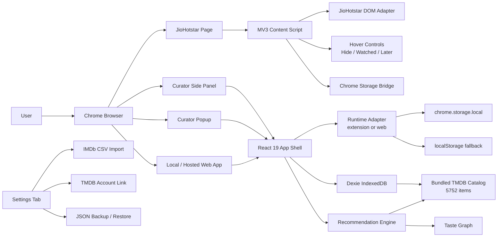
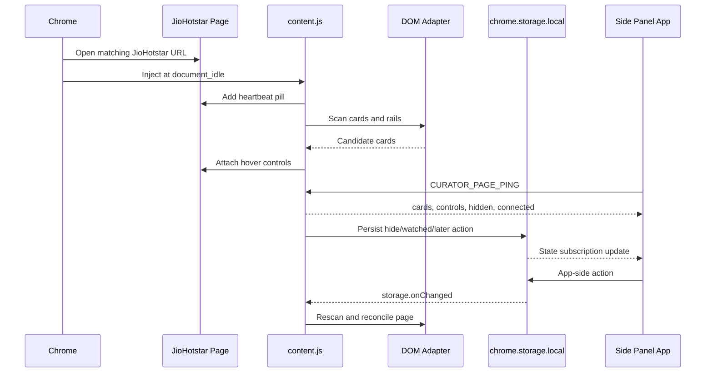
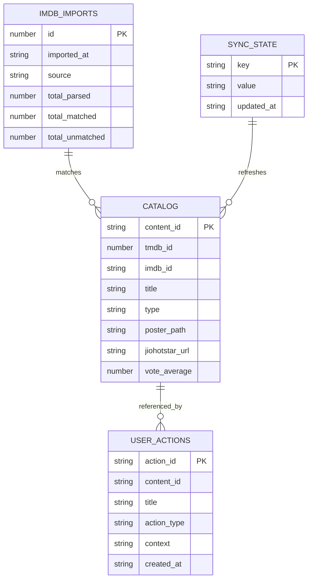
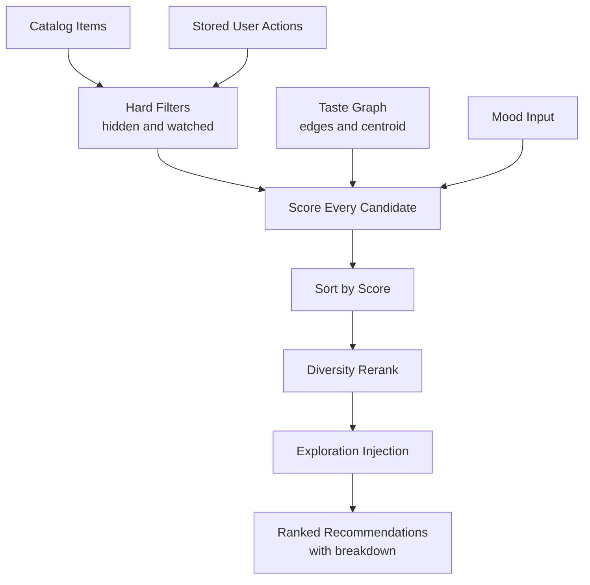

# JioHotstar Curator

<p align="center">
  <strong>A local-first Chrome MV3 extension and web app for curating JioHotstar, hiding noise, tracking watched titles, building a personal taste graph, and generating poster-rich recommendations from a 5,752-title catalog.</strong>
</p>

<p align="center">
  <a href="https://github.com/kunal-gh/thatone">
    
  </a>
  
  
  
  
  
</p>

<p align="center">
  
  
  
  
  
</p>

---

## Executive Summary

JioHotstar Curator turns JioHotstar into a personal, controllable discovery layer.

The extension injects lightweight hover controls directly into JioHotstar cards, lets the user hide titles, mark them watched, save them for later, and then uses those signals to build a local taste profile. The same product also runs as a standalone local web app, making it easy to test, demo, and eventually deploy as a hosted Vercel-style companion app.

It is built as a professional showcase project:

| Pillar | What This Repo Demonstrates |
|---|---|
| Product engineering | Chrome MV3 extension, side panel app, popup, web app, live JioHotstar page integration |
| Data engineering | TMDB-first catalog pipeline, JioHotstar provider filtering, OMDb enrichment, static bundled catalog |
| AI/product intelligence | Taste graph, embedding centroid, deterministic recommendation scoring, diversity reranking |
| Frontend engineering | React 19, TypeScript, responsive poster UI, swipe deck, system health diagnostics |
| Platform design | Local-first persistence, web/extension runtime abstraction, IndexedDB cache, backup/restore |
| Security posture | MV3 CSP, no backend by default, secret scanning, no credential commits, no DRM/cookie access |
| SDLC discipline | Task file, dev log, handoff docs, pipeline docs, verification scripts, repo runbooks |

---

## Product Snapshot

The product has four user-facing surfaces:

| Surface | Entry Point | Purpose |
|---|---|---|
| JioHotstar page layer | `src/extension/content.ts` | Injects hover controls into JioHotstar title cards and collapses hidden/watched cards without leaving blank rail slots. |
| Side panel app | `app.html` -> `src/app/App.tsx` | Full control center for recommendations, watchlist, library, taste graph, system health, and settings. |
| Popup | `popup.html` -> `src/popup/App.tsx` | Compact toolbar launcher and status surface. |
| Local web app | `index.html` -> `src/app/App.tsx` | Browser-testable app that works without extension APIs through localStorage and IndexedDB fallbacks. |

The same app shell runs in extension mode and web mode. That design makes the project easier to test live, easier to demo, and easier to deploy as a future hosted companion experience.

---

## Visual Architecture

<p align="center">
  
</p>



---

## What Problem It Solves

Streaming homepages are optimized for engagement, not for your memory, taste, or time. They repeatedly show content you already watched, titles you know you do not want, and recommendation rails that are hard to control.

JioHotstar Curator gives the user a layer of ownership:

| Problem | Curator Response |
|---|---|
| "I keep seeing the same movies and shows." | Mark as watched or hide from the live feed. |
| "I need a clean watchlist." | Save titles to Watch Later from JioHotstar or the app. |
| "Recommendations are not transparent." | Score details show embedding, taste, quality, mood, novelty, diversity, freshness, and penalties. |
| "The app does not feel connected." | Content heartbeat and side panel bridge status show whether the page layer is active. |
| "A hidden card leaves a blank space." | Rail wrapper collapse removes height, width, flex-basis, margins, and padding. |
| "I need to test outside Chrome extension mode." | The same app runs locally at `http://127.0.0.1:4173/`. |
| "I want data portability." | Versioned JSON backup and restore. |
| "I want my IMDb history involved." | IMDb CSV ratings/watchlist import with catalog matching. |
| "I want account sync." | TMDB account linking supports watchlist/ratings fetch through user-provided credentials. |

---

## Current Status

| Area | Status | Notes |
|---|---:|---|
| Chrome MV3 manifest | Complete | Permissions, host permissions, side panel, background worker, content script, CSP, icons. |
| Local web app mode | Complete | Uses runtime fallback instead of Chrome-only APIs. |
| JioHotstar page controls | Complete | Hover-only controls, rating badge, hide, watched, later, undo toast, heartbeat. |
| Blank-gap fix | Complete | Hidden/watched rail cards collapse horizontal footprint as well as height. |
| Live sync from app to page | Complete | Storage listener reschedules page processing when state changes. |
| Catalog | Complete | 5,752 bundled TMDB/JioHotstar catalog items. |
| Recommendations | Complete | Deterministic scoring with score breakdown and diversity rerank. |
| Swipe deck | Complete | Pointer drag, left/right/up actions, button fallbacks. |
| Watchlist | Complete | Watch Later tab with poster grid and actions. |
| Library | Complete | Hidden/watched management with catalog matching. |
| Taste graph | Complete | Genre/actor/director/language/keyword profile plus radar visualization. |
| IMDb import | Complete | CSV parser with auto-detect and fuzzy catalog matching. |
| TMDB account link | Complete | User-provided API key, auth flow, watchlist/ratings fetch. |
| Backup/restore | Complete | Versioned JSON export/import. |
| Logging | Complete | Structured ring buffer and diagnostics export. |
| Security scan | Complete | `npm run security:scan`. |
| Chrome Web Store release | Optional next step | Needs store assets, privacy policy, final review workflow. |
| Playwright extension E2E | Optional next step | Recommended for browser-level smoke coverage. |

---

## Feature Matrix

### JioHotstar Page Layer

| Feature | Implementation |
|---|---|
| DOM discovery | `src/extension/adapter.ts` scans JioHotstar cards, rails, homepage/search/detail layouts. |
| URL coverage | Manifest covers `hotstar.com`, `*.hotstar.com`, `jiohotstar.com`, and `*.jiohotstar.com`. |
| Hover actions | Controls reveal only on card hover/focus to avoid permanently covering posters. |
| Hide/watched collapse | `content.ts` collapses width, max-width, flex-basis, height, opacity, margin, and padding. |
| Watch Later | Saves title without removing it from the live feed. |
| Undo | Five-second toast can reverse the latest action. |
| Page status | Bottom-left heartbeat shows card count, control count, and hidden count. |
| SPA handling | MutationObserver, warmup scans, focus/visibility hooks, URL watcher. |
| Side panel bridge | Responds to `CURATOR_PAGE_PING` so the app can show connected/disconnected state. |

### Curator App

| Tab | What It Does |
|---|---|
| Discover | Ranked recommendations with poster cards, score badges, mood filter, content type filter, and score details. |
| Swipe | Tinder-style discovery deck. Swipe left to hide, right to mark watched, up to save. |
| Watchlist | Dedicated queue of saved titles with poster matching. |
| Library | Manage hidden and watched titles, remove records, export/import state. |
| Profile | Taste graph, radar chart, weighted affinity bars, embedding centroid details. |
| System | Runtime, storage provider, catalog count, DB status, recent action log, catalog rebuild. |
| Settings | IMDb import, TMDB account connection, backup/restore, diagnostics. |

### Data and Intelligence

| Capability | Implementation |
|---|---|
| Static catalog | `public/data/catalog/tmdb-jiohotstar-catalog.json`, 5,752 items. |
| Fallback catalog | `public/data/catalog/91mobiles-jiohotstar-seed.json`, 23 items. |
| Catalog sync | `loadCatalog()` and `syncCatalogToDb()` hydrate Dexie from bundled JSON. |
| Matching | Title, URL, IMDb ID, TMDB ID, fuzzy fallback. |
| Taste graph | Edge weights for genres, actors, directors, languages, moods, themes, runtime, decade, content type. |
| Embeddings | Lightweight precomputed/simple vectors for deterministic local scoring. |
| Recommendation scoring | Weighted formula with hard filters and diversity rerank. |
| Account imports | IMDb CSV import and TMDB account watchlist/ratings fetch. |

---

## Tech Stack

| Layer | Technology |
|---|---|
| Language | TypeScript 5.8 |
| UI | React 19, React DOM 19 |
| Build | Vite 7, TypeScript project references |
| Extension | Chrome Manifest V3, sidePanel API, service worker, content scripts |
| Local database | Dexie 4 over IndexedDB |
| Extension state | `chrome.storage.local` |
| Web fallback state | `localStorage` plus IndexedDB |
| Tests | Vitest 3, jsdom |
| Catalog tooling | Node scripts, TMDB API, OMDb enrichment, Cheerio seed pipeline |
| Security tooling | Custom secret scanner, `npm audit`, CSP headers |
| Deployment-ready web mode | `vercel.json` with security headers |

---

## Runtime Modes

The project intentionally supports two runtime modes.

| Mode | Command / Entry | Storage | Best For |
|---|---|---|---|
| Extension | Build `dist/`, load unpacked in Chrome | `chrome.storage.local` and IndexedDB | Real JioHotstar page filtering and side panel usage. |
| Local web app | `npm run dev -- --host 127.0.0.1 --port 4173` | `localStorage` and IndexedDB | Fast UI testing, live demo, future hosted app. |
| Static preview | `npm run build` then `npm run preview` | Browser local storage | Production bundle inspection. |
| Future hosted app | Vercel or any static host | Browser local storage unless an extension bridge is added | Portfolio/demo surface. |

The local web app cannot inject controls into JioHotstar by itself. Page-level filtering requires the Chrome extension content script. The web app exists so the product UI, catalog, recommendations, watchlist, profile, and settings can be tested without extension APIs.

---

## How The Extension Connects To JioHotstar



Connection is healthy when:

```text
CURATOR - 24 cards - 24 controls - 0 hidden
```

appears as the page heartbeat on JioHotstar, and the app health strip reports the bridge as connected.

---

## Data Model



### Catalog Item Shape

```ts
type CatalogItem = {
  content_id: string;
  source: "tmdb" | "91mobiles" | "omdb" | "manual";
  scraped_at: string;

  tmdb_id: number | null;
  imdb_id: string | null;
  jiohotstar_url: string | null;

  title: string;
  original_title: string | null;
  year: number | null;
  type: "movie" | "show" | "episode" | "special";
  overview: string | null;
  poster_path: string | null;

  language: string | null;
  genres: string[];
  keywords: string[];
  moods: string[];
  cast: string[];
  directors: string[];

  vote_average: number | null;
  vote_count: number | null;
  imdb_rating: number | null;
  runtime_minutes: number | null;
  release_date: string | null;

  availability_confidence: "high" | "medium" | "low";
  stream_providers: Array<{ provider: string; url: string | null }>;
  embedding: number[] | null;
};
```

### Stable Content IDs

Content IDs are deliberately namespaced by media type:

```text
tmdb:movie:550
tmdb:show:1396
title:normalized-title
```

Do not use plain `tmdb:{id}`. TMDB movie IDs and TV IDs can overlap, so `tmdb:movie:{id}` and `tmdb:show:{id}` prevent IndexedDB key collisions.

---

## Recommendation Engine

The recommendation engine is deterministic, local, inspectable, and designed for explainability.



The scoring formula:

```text
score =
  0.35 * embedding_relevance
+ 0.20 * taste_graph_match
+ 0.15 * quality_signal
+ 0.10 * mood_fit
+ 0.08 * novelty
+ 0.07 * diversity_score
+ 0.05 * freshness
- penalties
```

| Signal | Purpose |
|---|---|
| Embedding relevance | Compares catalog item vectors to the learned taste centroid. |
| Taste graph match | Uses positive/negative affinity for genres, actors, directors, languages, moods, and themes. |
| Quality signal | Normalized TMDB rating signal. |
| Mood fit | Boosts items matching a mood/theme search. |
| Novelty | Encourages discovery beyond recently watched genre clusters. |
| Diversity score | Supports variety before final rerank. |
| Freshness | Helps newer releases surface when relevant. |
| Penalties | Downranks low-confidence availability or missing playable URLs. |

Hard filters remove hidden titles and watched titles from recommendations by default.

---

## Taste Graph

The taste graph is a local user model built from actions:

| Action | Effect |
|---|---|
| Hide | Negative signal for matched title features. |
| Watched | Positive signal for matched title features and centroid updates. |
| Watch Later | Queue signal without removing from feed. |
| IMDb import | Converts imported ratings/watchlist rows into catalog-aware profile signals. |
| TMDB sync | Pulls watchlist/ratings into the same local profile model. |

The graph stores weighted edges:

```text
genre:thriller      +0.42
actor:vidya-balan   +0.31
director:some-name  -0.15
language:hi         +0.22
keyword:spy         +0.18
```

The app visualizes this profile with:

| View | Component |
|---|---|
| Genre radar | `src/components/RadarChart.tsx` |
| Affinity bars | Profile tab in `src/app/App.tsx` |
| Embedding centroid | Profile tab centroid chip view |

---

## Catalog Pipeline

The production catalog is bundled into the extension and app:

```text
public/data/catalog/tmdb-jiohotstar-catalog.json
```

It currently contains:

| Type | Count |
|---|---:|
| Total items | 5,752 |
| Movies | 4,020 |
| Shows | 1,732 |

The catalog pipeline:

```mermaid
flowchart LR
    Env[".env credentials"] --> TMDB["TMDB Discover API"]
    TMDB --> Provider["JioHotstar India Provider Filter"]
    Provider --> Pages["Paginated Fetch"]
    Pages --> Details["Credits / Keywords / External IDs"]
    Details --> OMDb["Optional OMDb Enrichment"]
    OMDb --> Embed["Feature Vector Build"]
    Embed --> JSON["tmdb-jiohotstar-catalog.json"]
    JSON --> Public["public/data/catalog"]
    Public --> Build["Vite / Extension Build"]
    Build --> Dexie["IndexedDB Catalog Cache"]
```



Run the full catalog build:

```bash
npm run catalog:tmdb
```

Expected `.env` shape:

```bash
TMDB_BEARER_TOKEN=<token>
OMDB_API_KEY=<key>
```

Run the small seed catalog build:

```bash
npm run catalog:seed
```

The `.env` file is ignored by Git. Do not print, paste, commit, screenshot, or include local credentials in issue reports.

---

## Account Integrations

### IMDb

IMDb support is implemented through CSV import, not live IMDb account OAuth.

This is intentional and honest: the project does not rely on a private IMDb account API. The Settings tab accepts IMDb Ratings or Watchlist CSV exports, parses them locally, and matches them against the bundled catalog using IMDb ID, title/year, and fuzzy fallback matching.

| Import Type | Supported |
|---|---:|
| IMDb ratings CSV | Yes |
| IMDb watchlist CSV | Yes |
| Live IMDb OAuth account sync | No |
| Private IMDb scraping | No |

### TMDB

TMDB account support is implemented for users who provide their own TMDB API key.

| Flow | Supported |
|---|---:|
| API key verification | Yes |
| Request token creation | Yes |
| User approval | Yes |
| Session creation | Yes |
| Watchlist fetch | Yes |
| Ratings fetch | Yes |
| Local catalog matching | Yes |

TMDB values are stored locally in the browser context. They are not committed to the repo.

---

## Security And Privacy Model

This project is designed as a local-first tool with minimal trust assumptions.

| Security Area | Current Behavior |
|---|---|
| Backend | No backend required. |
| User data | Stored locally in `chrome.storage.local`, `localStorage`, and IndexedDB. |
| JioHotstar credentials | Not read, not stored, not transmitted. |
| DRM/media streams | Not touched. No bypass behavior. |
| Cookies | Not intercepted or exported. |
| API keys | User-provided, local only, ignored by Git. |
| Secret scanning | `npm run security:scan` checks tracked and untracked non-ignored project files. |
| Extension CSP | MV3 CSP uses `script-src 'self'`. |
| Web CSP | `vercel.json` defines CSP, referrer policy, nosniff, and permissions policy. |
| Permissions | Limited to storage, tabs, alarms, sidePanel, and matching JioHotstar host permissions. |
| Supply chain | `package-lock.json`, npm overrides for esbuild, `npm audit` support. |

### Threat Boundaries

| Boundary | Decision |
|---|---|
| JioHotstar page DOM | Read public page card metadata and attach local controls. |
| JioHotstar private APIs | Not used. |
| Streaming playback | Not modified. |
| User account tokens | Not accessed. |
| Remote model calls | None by default. |
| Catalog updates | Explicit local build command or bundled static JSON. |
| Hosted backend | Optional future work, not required. |

### Security Commands

```bash
npm run security:scan
npm audit
```

The verification script includes tests, build, and the secret scan:

```bash
npm run verify
```

---

## Quick Start

### Install

```bash
npm install
```

### Run The Local Web App

```bash
npm run dev -- --host 127.0.0.1 --port 4173
```

Open:

```text
http://127.0.0.1:4173/
```

Use this mode to test the app UI, catalog, recommendations, watchlist, profile, settings, backup/restore, and system health.

### Build Production Assets

```bash
npm run build
```

Build output lands in:

```text
dist/
```

### Preview Production Web Build

```bash
npm run preview -- --host 127.0.0.1 --port 4173
```

---

## Load As A Chrome Extension

1. Run:

   ```bash
   npm run build
   ```

2. Open:

   ```text
   chrome://extensions
   ```

3. Enable Developer mode.

4. Click Load unpacked.

5. Select:

   ```text
   dist/
   ```

6. Open JioHotstar:

   ```text
   https://www.hotstar.com/in/home
   ```

7. Verify the heartbeat appears at the bottom-left of the page.

8. Open the extension side panel or popup.

After every rebuild:

1. Go back to `chrome://extensions`.
2. Click the reload icon on JioHotstar Curator.
3. Reload the JioHotstar tab.

---

## JioHotstar Connection Troubleshooting

| Symptom | Check |
|---|---|
| No heartbeat pill on JioHotstar | Rebuild, reload the unpacked extension, then reload the JioHotstar tab. |
| Side panel opens but bridge says disconnected | Make sure the active tab is a matching JioHotstar URL, then reload the page. |
| Controls do not appear | Hover directly over a movie/show card. Controls are hidden until hover/focus. |
| Hidden cards leave blank gaps | Make sure the latest build is loaded. v1.2.0 collapses rail item width and flex-basis. |
| App actions do not reflect on page | Keep the JioHotstar tab open. The content script listens to `chrome.storage.onChanged` and rescans. |
| Local app works but page controls do not | The local web app cannot inject into JioHotstar. Load the Chrome extension for page-level controls. |
| Catalog count is low | Open System tab and click Rebuild Local Catalog. |
| `127.0.0.1` refused connection | Start the dev or preview server first. |

---

## Build Outputs

| Output | Purpose |
|---|---|
| `dist/index.html` | Web app entry. |
| `dist/app.html` | Extension side panel / full app entry. |
| `dist/popup.html` | Toolbar popup entry. |
| `dist/manifest.json` | Chrome MV3 manifest. |
| `dist/extension/background.js` | Service worker. |
| `dist/extension/content.js` | Standalone IIFE content script. |
| `dist/assets/` | React, CSS, and Vite assets. |
| `dist/data/catalog/` | Bundled catalog JSON. |
| `dist/icons/` | Extension icons. |

---

## Verification

Run the full project verification:

```bash
npm run verify
```

That command runs:

| Step | Command |
|---|---|
| Tests | `vitest run` |
| Type/build | `tsc -b && vite build && node ./scripts/build-content.mjs` |
| Secret scan | `node ./scripts/security/scan-secrets.mjs` |

Additional audit:

```bash
npm audit
```

Expected current result:

```text
40 tests passing
production build passing
content script bundle generated
secret scan passing
npm audit clean
```

---

## Repository Map

```text
.
|-- app.html
|-- index.html
|-- popup.html
|-- package.json
|-- public/
|   |-- manifest.json
|   |-- icons/
|   `-- data/catalog/
|       |-- tmdb-jiohotstar-catalog.json
|       `-- 91mobiles-jiohotstar-seed.json
|-- scripts/
|   |-- build-content.mjs
|   |-- catalog/
|   |   |-- build-catalog.mjs
|   |   `-- build-tmdb-catalog.mjs
|   `-- security/
|       `-- scan-secrets.mjs
|-- src/
|   |-- app/
|   |   |-- App.tsx
|   |   `-- main.tsx
|   |-- popup/
|   |   |-- App.tsx
|   |   `-- main.tsx
|   |-- extension/
|   |   |-- adapter.ts
|   |   |-- adapter.test.ts
|   |   |-- background.ts
|   |   |-- content-storage.ts
|   |   |-- content.ts
|   |   `-- fixtures/
|   |-- components/
|   |   |-- ErrorBoundary.tsx
|   |   |-- PosterCard.tsx
|   |   |-- RadarChart.tsx
|   |   |-- SettingsTab.tsx
|   |   `-- SwipeDeck.tsx
|   |-- shared/
|   |   |-- catalog.ts
|   |   |-- curation.ts
|   |   |-- data-transfer.ts
|   |   |-- db.ts
|   |   |-- imdb-import.ts
|   |   |-- logger.ts
|   |   |-- normalize.ts
|   |   |-- recommend.ts
|   |   |-- runtime.ts
|   |   |-- storage.ts
|   |   |-- taste.ts
|   |   |-- tmdb-account.ts
|   |   `-- types.ts
|   `-- styles/
|       `-- base.css
|-- Docs/
|   |-- BUILD_AND_LOAD.md
|   |-- CATALOG_PIPELINE.md
|   |-- HANDOFF.md
|   |-- PROJECT_BRIEF.md
|   `-- architecture_diagram.png
|-- logs/
|   `-- DEV_LOG.md
`-- tasks/
    `-- TASKS.md
```

---

## Key Files Explained

| File | Why It Matters |
|---|---|
| `src/extension/content.ts` | The live JioHotstar integration layer. Dependency-light, built as standalone IIFE. |
| `src/extension/adapter.ts` | Handles changing JioHotstar DOM structures and card/title extraction. |
| `src/extension/background.ts` | MV3 service worker for extension events, side panel behavior, alarms, and metadata requests. |
| `src/app/App.tsx` | Main application shell and tab orchestration. |
| `src/shared/runtime.ts` | Detects extension vs. web runtime. Keeps web mode from crashing on missing `chrome.*`. |
| `src/shared/storage.ts` | State adapter for Chrome storage and localStorage fallback. |
| `src/shared/db.ts` | Dexie schema and IndexedDB tables. |
| `src/shared/catalog.ts` | Catalog loading, matching, embeddings, freshness helpers. |
| `src/shared/recommend.ts` | Recommendation scoring, hard filters, exploration, diversity rerank. |
| `src/shared/taste.ts` | Taste graph updates, temporal decay, centroid computation. |
| `src/shared/imdb-import.ts` | IMDb CSV parsing and catalog matching. |
| `src/shared/tmdb-account.ts` | TMDB account authorization and sync helpers. |
| `src/shared/data-transfer.ts` | Backup and restore. |
| `src/components/PosterCard.tsx` | Poster rendering, score ring, hover actions. |
| `src/components/SwipeDeck.tsx` | Gesture-based recommendation flow. |
| `scripts/build-content.mjs` | Builds dependency-safe content script bundle. |
| `scripts/security/scan-secrets.mjs` | Secret scanner for tracked and untracked non-ignored files. |

---

## Content Script Design Constraints

The content script runs inside JioHotstar pages. That environment should stay small and predictable.

Rules:

| Constraint | Reason |
|---|---|
| No heavy npm dependencies in `content.ts` | Faster injection, fewer runtime risks, safer MV3 bundle. |
| Keep imports local and zero-dependency | The IIFE build expects a narrow graph. |
| Never access cookies or auth tokens | Product scope is DOM curation, not account extraction. |
| Avoid private JioHotstar APIs | More stable, more ethical, less brittle. |
| Use MutationObserver and warmup scans | JioHotstar is a client-rendered app with dynamic rails. |
| Collapse the rail item wrapper | Hiding inner posters leaves blank spaces; hiding the wrapper fixes layout. |

The current content script imports only:

```text
src/extension/content-storage.ts
src/extension/adapter.ts
src/shared/normalize.ts
src/shared/types.ts (type-only)
```

---

## Testing Strategy

| Test Area | Coverage |
|---|---|
| Adapter fixtures | Homepage rail, search results, detail rail, URL patterns, title extraction. |
| Storage | Chrome/local fallback behavior and state updates. |
| Recommendations | Hard filters, scoring, diversity, exploration behavior. |
| Build | TypeScript, Vite, extension content script bundle. |
| Security | Secret scanner and npm audit. |

Current automated test command:

```bash
npm test
```

Recommended next professional layer:

| Future Test | Purpose |
|---|---|
| Playwright extension smoke test | Launch Chromium with unpacked extension, open JioHotstar, assert heartbeat. |
| Visual regression snapshots | Lock UI states for Discover, Swipe, Watchlist, Settings, System. |
| Catalog contract test | Validate schema and count for bundled catalog. |
| Backup/restore round-trip E2E | Verify portable user state survives export/import. |

---

## Deployment Model

### Extension

The Chrome extension is distributed from `dist/` after `npm run build`.

For Chrome Web Store packaging, the remaining release checklist is:

| Item | Status |
|---|---:|
| MV3 manifest | Done |
| Icons | Done |
| Extension build | Done |
| Privacy/security posture | Done |
| Store screenshots | Needed |
| Store description | Needed |
| Privacy policy page | Needed |
| Manual QA checklist | Needed |
| Final zipped package | Needed |

### Hosted Web App

The web app can be deployed as a static app. `vercel.json` already defines hardened headers:

| Header | Purpose |
|---|---|
| `Content-Security-Policy` | Restricts script, connect, object, frame, base, form, image sources. |
| `Referrer-Policy` | Uses strict origin behavior. |
| `X-Content-Type-Options` | Prevents MIME sniffing. |
| `Permissions-Policy` | Disables camera, microphone, and geolocation. |

The hosted web app will not inject into JioHotstar unless a future extension bridge is added. It will remain useful for recommendations, profile, watchlist, backup/restore, and catalog exploration.

---

## SDLC Documentation

The repo intentionally contains operational project documentation so another developer or another MCP agent can continue without losing context.

| File | Purpose |
|---|---|
| `tasks/TASKS.md` | Task list and development status. |
| `logs/DEV_LOG.md` | Session history and implementation log. |
| `Docs/HANDOFF.md` | Current architecture, important notes, and remaining work. |
| `Docs/BUILD_AND_LOAD.md` | How to run, build, load, and troubleshoot. |
| `Docs/CATALOG_PIPELINE.md` | Catalog schema, rebuild process, staleness model. |
| `Docs/PROJECT_BRIEF.md` | Product objective and phase summary. |

---

## Developer Runbook

### Daily Development

```bash
npm install
npm run dev -- --host 127.0.0.1 --port 4173
```

### Extension QA Loop

```bash
npm run build
```

Then:

1. Reload extension in `chrome://extensions`.
2. Reload JioHotstar tab.
3. Confirm heartbeat.
4. Hover a card.
5. Test Hide, Watched, Later.
6. Open side panel.
7. Confirm health strip and bridge status.

### Before Commit

```bash
npm run verify
npm audit
git status --short
```

### Before Sharing With Another Developer

Update:

```text
tasks/TASKS.md
logs/DEV_LOG.md
Docs/HANDOFF.md
Docs/BUILD_AND_LOAD.md
README.md
```

Never include `.env`, local API keys, OAuth session values, browser profile data, exported user backups, or screenshots that expose private tokens.

---

## Environment Variables

Only the catalog rebuild scripts need external credentials.

```bash
TMDB_BEARER_TOKEN=<token>
OMDB_API_KEY=<key>
```

Do not commit `.env`. The app and extension can run with the already bundled catalog without these values.

---

## Common Commands

| Command | Purpose |
|---|---|
| `npm install` | Install dependencies from lockfile. |
| `npm run dev -- --host 127.0.0.1 --port 4173` | Run local web app. |
| `npm run build` | Build web app, extension pages, manifest assets, and content script. |
| `npm run preview -- --host 127.0.0.1 --port 4173` | Preview production web build. |
| `npm test` | Run Vitest. |
| `npm run security:scan` | Scan repo files for secret patterns. |
| `npm run verify` | Tests, build, content script, secret scan. |
| `npm audit` | Dependency vulnerability audit. |
| `npm run catalog:tmdb` | Rebuild full TMDB/JioHotstar catalog. |
| `npm run catalog:seed` | Rebuild small fallback catalog. |

---

## Engineering Highlights

### 1. One Product, Two Runtimes

The app is built to run in both extension and web contexts. Runtime detection isolates Chrome-only APIs from shared app logic, so the UI can be tested locally and deployed as a static app without breaking.

### 2. Local-First Data Ownership

User actions, profile signals, imports, and catalog cache stay in the browser. No always-on backend is required for the core product.

### 3. Transparent Recommendation Logic

The recommender is not a black box. Each recommendation includes a score breakdown, making it easier to debug and easier to explain.

### 4. DOM Adapter Layer

JioHotstar page structures can change. The adapter isolates selectors, URL patterns, and title extraction so the content script can stay readable and testable.

### 5. Robust Page Reconciliation

The content script handles dynamic rails, route changes, lazy-rendered content, focus events, and side panel state changes.

### 6. Production-Oriented Security Basics

The repo has secret scanning, CSP, minimal extension permissions, no token scraping, no committed credentials, no backend dependency, and clear threat boundaries.

### 7. Handoff-Ready Documentation

The project includes task tracking, dev logs, build docs, handoff docs, catalog docs, and this README so development can resume after crashes, tool limits, or agent changes.

---

## Honest Limitations

| Limitation | Current Position |
|---|---|
| No live IMDb OAuth | IMDb is supported via CSV import only. |
| No JioHotstar private API integration | The extension works through public page DOM and local state. |
| No automatic hosted catalog refresh | The catalog is rebuilt by script and bundled. |
| No cloud sync | User state is local unless exported/imported. |
| No Chrome Web Store package yet | Extension can be loaded unpacked; store release still needs assets and policy docs. |
| No Playwright browser E2E yet | Unit/integration tests exist; full extension browser smoke tests are recommended next. |

---

## Roadmap

| Priority | Item | Why It Matters |
|---|---|---|
| High | Playwright extension smoke test | Proves the extension connects to JioHotstar in real Chromium. |
| High | Chrome Web Store release package | Turns the project into a distributable extension. |
| Medium | Privacy policy and store listing | Required for public extension release. |
| Medium | Trakt.tv integration | Industry-standard media account sync complementing TMDB and IMDb CSV import. |
| Medium | Hosted catalog manifest | Allows catalog refresh without rebuilding the extension. |
| Low | Cloudflare Worker TMDB proxy | Optional protection so users do not expose TMDB keys in browser network tools. |
| Low | Extension-to-web bridge | Lets a hosted app communicate with the installed extension. |
| Low | Visual regression suite | Locks the product UI quality over time. |

---

## Release Notes

### v1.2.0

| Area | Change |
|---|---|
| Page curation | Hidden/watched JioHotstar cards now collapse rail wrapper footprint, fixing black blank spaces. |
| Live sync | Already-processed cards reconcile with storage on every scan. |
| UX | Hover-only card controls keep posters visible until interaction. |
| Diagnostics | Page heartbeat and app bridge health help prove connection state. |
| Data | Dexie v2 includes `imdb_imports` and `sync_state`. |
| Settings | Backup/restore, IMDb import, TMDB linking, diagnostics. |
| Security | Structured logging, CSP posture, secret scan script. |

### v1.0.0 to v1.1.x

| Area | Change |
|---|---|
| Catalog | Full TMDB/JioHotstar catalog bundled. |
| Recommendations | Scoring engine, taste graph, diversity rerank. |
| UI | Discover, Swipe, Watchlist, Library, Profile, System, Settings. |
| Extension | MV3 manifest, popup, side panel, content script, service worker. |

---

## Verification Checklist For Reviewers

Use this checklist when reviewing or demoing the project.

| Check | Expected |
|---|---|
| `npm install` | Dependencies install from lockfile. |
| `npm run dev -- --host 127.0.0.1 --port 4173` | Local app opens at `127.0.0.1:4173`. |
| Discover tab | Poster-rich recommendations appear. |
| Swipe tab | Drag and buttons trigger actions. |
| Watchlist tab | Saved Later items appear. |
| System tab | Catalog count is near 5,752. |
| Settings tab | IMDb import, TMDB link, backup/restore sections render. |
| `npm run build` | Builds `dist/` and standalone `extension/content.js`. |
| Chrome load unpacked | Extension loads from `dist/`. |
| JioHotstar heartbeat | Page shows Curator connection pill. |
| Hover a title card | Hide, Watched, Later controls appear. |
| Hide a title | Card collapses without blank rail slot. |
| Side panel bridge | Health strip reports connected when active tab is JioHotstar. |
| `npm run security:scan` | Passes without secret findings. |
| `npm audit` | No known vulnerabilities expected. |

---

## License

This repository is currently private/project-specific unless a license is added. Add an explicit license before public reuse, distribution, or external collaboration.

---

## Project Identity

JioHotstar Curator is not only a browser extension. It is a compact demonstration of modern product engineering:

```text
Chrome MV3 extension
+ React/Vite app architecture
+ local-first persistence
+ catalog data pipeline
+ recommendation engine
+ account import/sync
+ secure operational discipline
+ handoff-ready documentation
```

The result is a practical product that filters a real streaming interface while also showcasing the engineering decisions behind a scalable, testable, security-aware browser platform.
