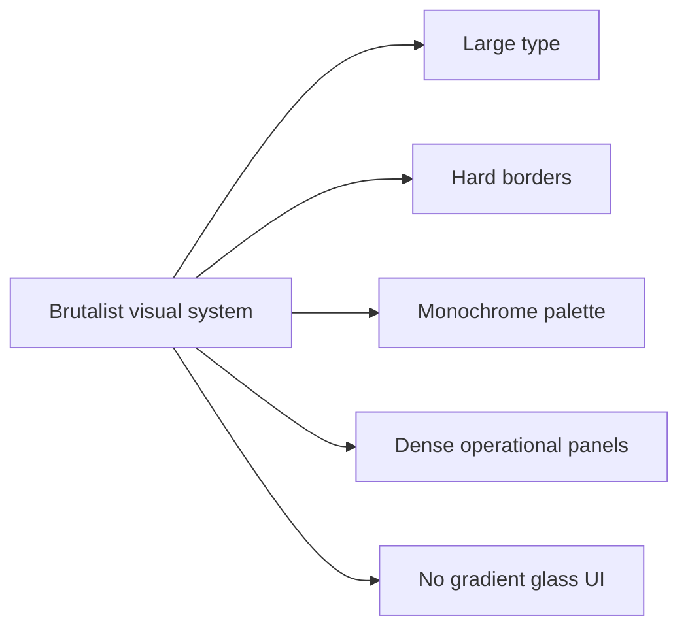
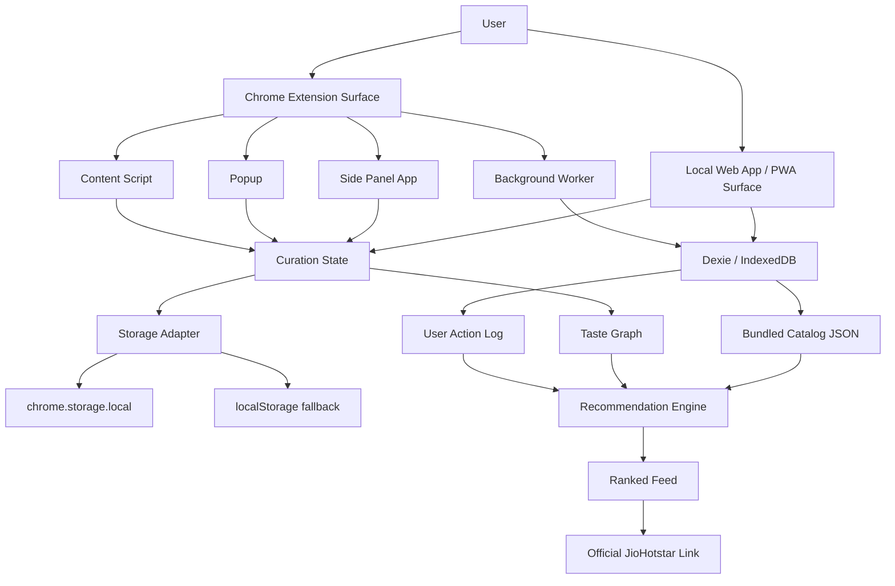
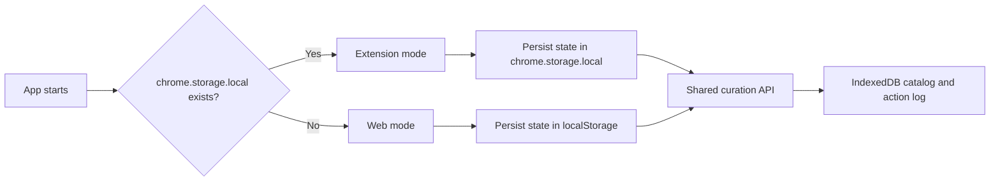
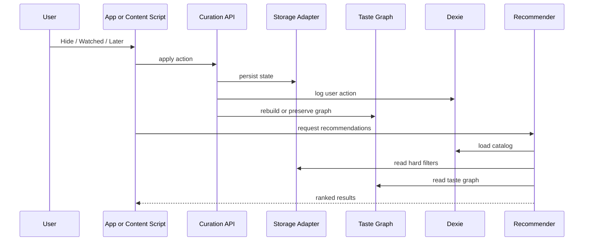
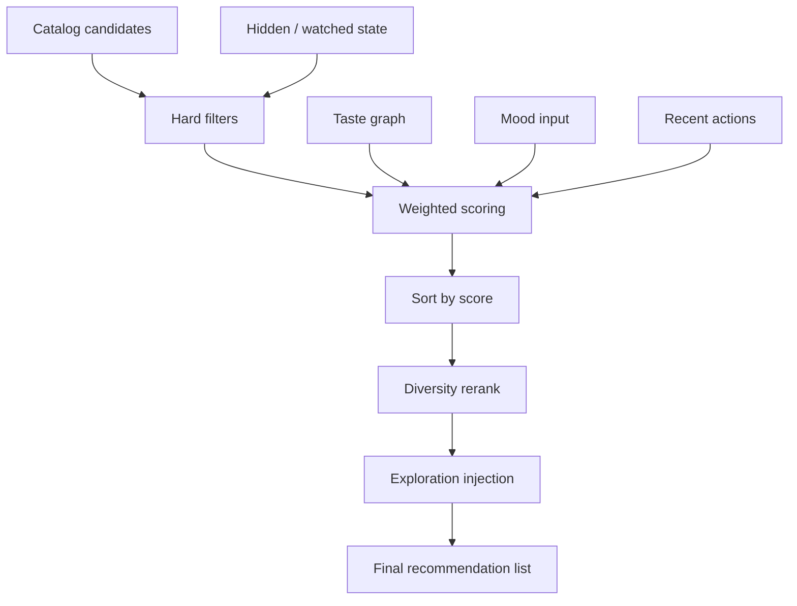
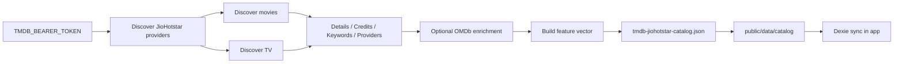
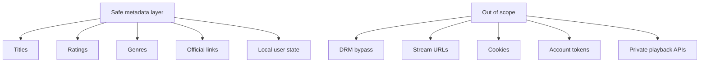
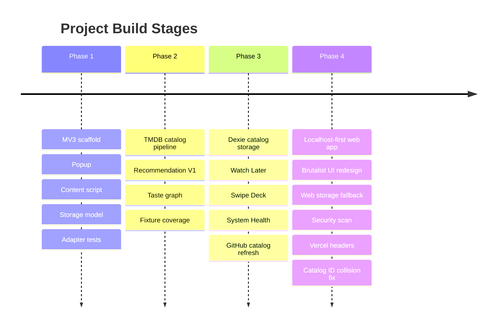

<div align="center">

# Personal JioHotstar Curator

### A local-first recommendation and filtering layer for JioHotstar

Hide unwanted titles, track watched content, build a private taste graph, and browse a cleaner recommendation surface powered by a full local catalog.

<br />


<br />


</div>

---

## Table Of Contents

- [What This Is](#what-this-is)
- [Why It Exists](#why-it-exists)
- [Current Product State](#current-product-state)
- [Visual System](#visual-system)
- [Core Surfaces](#core-surfaces)
- [Architecture](#architecture)
- [Tech Stack](#tech-stack)
- [Recommendation Engine](#recommendation-engine)
- [Catalog Pipeline](#catalog-pipeline)
- [Storage Model](#storage-model)
- [Security And Compliance](#security-and-compliance)
- [Run Locally](#run-locally)
- [Build Extension](#build-extension)
- [Verification](#verification)
- [Repository Map](#repository-map)
- [Development Timeline](#development-timeline)
- [Future Roadmap](#future-roadmap)
- [Handoff Notes](#handoff-notes)

---

## What This Is

Personal JioHotstar Curator is a dual-surface product:

| Surface | Purpose | Entry |
| --- | --- | --- |
| Local web app | Fast live testing, recommendations, swipe deck, state management, future Vercel deployment | `index.html` |
| Chrome extension | On-page filtering inside JioHotstar with injected controls | `popup.html`, `app.html`, content script |

The product is built for one clear job: give the viewer control over a noisy streaming homepage without touching protected streams, DRM, account internals, or private playback systems.

It works with:

- Metadata
- Browser UI state
- Local storage
- IndexedDB
- Official JioHotstar links
- A generated catalog of available titles

It does not work with:

- DRM streams
- Stream manifests
- Cookies
- Session tokens
- Account credentials
- Platform-private playback APIs

---

## Why It Exists

Streaming platforms optimize recommendations for broad engagement. That is not always the same as personal taste.

This project solves a very specific pain:

> "I want to permanently remove titles I do not want, track what I already watched, and get a cleaner feed that reflects my own taste."

The product approach is:

1. Detect titles on JioHotstar pages.
2. Let the user mark titles as `hidden`, `watched`, or `watch_later`.
3. Store every decision locally.
4. Build a taste graph from those decisions.
5. Score a catalog of JioHotstar titles.
6. Recommend only unseen and unblocked content.
7. Keep playback inside official JioHotstar pages.

---

## Current Product State

| Area | Status | Details |
| --- | --- | --- |
| Local web app | Complete | Runs at `http://127.0.0.1:4173/` |
| Extension shell | Complete | Manifest V3 with popup, side panel, background, content script |
| Catalog | Complete | 5,752 unique TMDB/JioHotstar items bundled |
| Recommendation V1 | Complete | Deterministic scoring, hard filters, diversity rerank, exploration |
| Taste graph | Complete | Genre, cast, director, language, decade, content type |
| Watch Later | Complete | App and content-script support |
| Swipe Deck | Complete | Fast preference training from catalog recommendations |
| Health dashboard | Complete | Runtime, storage, catalog, DB, action log, backend |
| Web storage fallback | Complete | Works without `chrome.*` APIs |
| Security scan | Complete | `npm run security:scan` |
| Vercel readiness | Ready | Static build plus security headers |
| Audit state | Clean | `npm audit` reports 0 vulnerabilities |

---

## Visual System

The current UI uses a minimal brutalist monochrome system:

| Design Rule | Implementation |
| --- | --- |
| Palette | Black, white, and neutral gray shades |
| Shape language | Square cards, low radius, strong borders |
| Typography | Large uppercase headlines, compact operational labels |
| Layout | Dense but readable dashboard surfaces |
| Motion | Minimal, state-driven, not decorative |
| Accessibility | High contrast, clear button labels, stable layout |

The UI is intentionally not a marketing landing page. The app opens directly into the working product.



---

## Core Surfaces

### Web App Tabs

| Tab | What It Does | Primary Files |
| --- | --- | --- |
| Recommendations | Scores and ranks catalog items, supports mood/type/mode controls | `src/app/App.tsx`, `src/shared/recommend.ts` |
| Swipe Deck | Quickly trains taste signals with hide/watch/later/skip actions | `src/app/App.tsx`, `src/shared/curation.ts` |
| Manage | Lists hidden/watched items, supports import/export and removal | `src/app/App.tsx`, `src/shared/storage.ts` |
| Watch Later | Queue for titles saved for later | `src/app/App.tsx` |
| Taste Graph | Shows taste edges and centroid | `src/shared/taste.ts` |
| System Health | Shows runtime, storage, catalog, DB, action log, backend status | `src/app/App.tsx`, `src/shared/runtime.ts` |

### Extension Surfaces

| Surface | Purpose |
| --- | --- |
| Toolbar popup | Compact stats and launcher |
| Side panel | Full app inside extension context |
| Content script | Injects controls into JioHotstar cards |
| Background worker | Metadata lookup, taste graph sync, alarm hook |

---

## Architecture

### System Overview



### Runtime Split



### Data Flow



---

## Tech Stack

### Application Stack

| Layer | Technology | Why |
| --- | --- | --- |
| UI framework | React 19 | Component-driven app and popup surfaces |
| Language | TypeScript 5.8 | Safer data models for catalog, state, graph, and recommendation pipeline |
| Build tool | Vite 7 | Fast dev server and multi-entry production builds |
| Extension platform | Chrome Manifest V3 | Content script, popup, side panel, background worker |
| Local database | Dexie over IndexedDB | Large catalog and action log storage |
| Extension state | `chrome.storage.local` | Persistent extension-owned user state |
| Web fallback | `localStorage` | Makes the same app runnable as a normal URL |
| Tests | Vitest + jsdom | Fast unit tests for adapter, storage, recommendation logic |
| Catalog parsing | Cheerio | HTML parsing for seed/validator catalog |
| Static deploy config | Vercel headers | Security policy for future hosted PWA |

### Data Stack

| Data Type | Storage | Notes |
| --- | --- | --- |
| Catalog | IndexedDB via Dexie | Synced from bundled public JSON |
| Hidden/watched/later state | Chrome storage or localStorage | Runtime-dependent adapter |
| Taste graph | Chrome storage or localStorage | Recomputed from stored state |
| Action log | IndexedDB via Dexie | Local analytics and future learning |
| Catalog source | TMDB watch providers | India region, JioHotstar/Hotstar provider filter |
| Seed fallback | 91mobiles | Small fallback and validator source |

### Security Stack

| Area | Implementation |
| --- | --- |
| Secret prevention | `.env` ignored, secret scanner script |
| Dependency audit | `npm audit`, `esbuild` override to fixed release |
| Static headers | CSP, referrer policy, permissions policy |
| Playback safety | Official JioHotstar links only |
| Local-first privacy | No required backend |
| Token handling | Catalog scripts read keys from `.env`, never from client runtime |

---

## Recommendation Engine

The recommendation engine is deterministic and explainable. It runs fully in the browser.

### Pipeline



### Score Formula

```text
total =
  0.35 * embedding_relevance
+ 0.20 * taste_graph_match
+ 0.15 * quality_signal
+ 0.10 * mood_fit
+ 0.08 * novelty
+ 0.07 * diversity_score
+ 0.05 * freshness
- penalties
```

### Signals

| Signal | Meaning |
| --- | --- |
| Embedding relevance | Similarity to watched-item centroid |
| Taste graph match | Match against genre/cast/director/language/decade preferences |
| Quality signal | TMDB rating normalized |
| Mood fit | Match against mood text, genres, keywords, moods |
| Novelty | Avoids repetitive recent watched genres |
| Diversity score | Prevents over-concentration of same genre/director/actor |
| Freshness | Release-date recency signal |
| Penalties | Availability confidence and missing URL penalties |

### Hard Filters

Hard filters run before scoring:

- Hidden titles are never recommended.
- Watched titles are excluded by default.
- URL keys and title keys both count.
- Mirrored title/url storage records are deduped for app views.

---

## Catalog Pipeline

### Current Catalog Health

| Metric | Value |
| --- | --- |
| Primary catalog items | 5,752 |
| Movies | 4,020 |
| Shows | 1,732 |
| Unique `content_id` values | 5,752 |
| Duplicate IDs | 0 |
| Seed fallback items | 23 |

### Catalog Generation



### Critical ID Rule

TMDB movie IDs and TV IDs can collide. The project uses media-type-scoped IDs:

```text
tmdb:movie:{tmdb_id}
tmdb:show:{tmdb_id}
```

Do not change this back to `tmdb:{id}`. The old format caused primary-key collisions in IndexedDB and reduced the loaded catalog from 5,752 rows to 5,740 rows.

---

## Storage Model

### Stored State

```ts
type ItemState = "hidden" | "watched" | "watch_later";

type StoredItem = {
  canonicalKey: string;
  title: string;
  sourceUrl?: string;
  state: ItemState;
  updatedAt: string;
};

type StoredState = {
  items: Record<string, StoredItem>;
};
```

### Taste Graph

```ts
type TasteGraph = {
  edges: Record<string, TasteEdge>;
  taste_centroid: number[] | null;
  centroid_updated_at: string | null;
};
```

### Runtime Storage Decision

| Runtime | State storage | Catalog storage | Action log |
| --- | --- | --- | --- |
| Extension | `chrome.storage.local` | IndexedDB | IndexedDB |
| Web app | `localStorage` | IndexedDB | IndexedDB |

---

## Security And Compliance

This project is designed around a strict safety boundary:



### Security Measures

| Control | Status |
| --- | --- |
| `.env` ignored | Enabled |
| Secret scanner | Enabled |
| Security headers | Enabled in `vercel.json` |
| NPM audit | Clean |
| Dependency override | `esbuild` pinned to fixed range |
| Backend secrets in client | None required |
| Playback handling | Official JioHotstar links only |

---

## Run Locally

```bash
npm install
npm run dev -- --host 127.0.0.1 --port 4173
```

Open:

```text
http://127.0.0.1:4173/
```

The local web app uses:

- `index.html`
- React app bundle
- localStorage fallback
- IndexedDB catalog/action log
- bundled catalog JSON

---

## Build Extension

```bash
npm run build
```

Then:

1. Open `chrome://extensions`.
2. Enable Developer mode.
3. Click `Load unpacked`.
4. Select `dist/`.

### Build Outputs

| Output | Purpose |
| --- | --- |
| `dist/index.html` | Web app entry |
| `dist/app.html` | Extension side-panel/full-app entry |
| `dist/popup.html` | Extension toolbar popup |
| `dist/manifest.json` | Chrome MV3 manifest |
| `dist/extension/content.js` | Injected JioHotstar controls |
| `dist/extension/background.js` | Extension background worker |
| `dist/data/catalog/` | Bundled catalog files |

---

## Verification

### Full Verification

```bash
npm run verify
npm audit --audit-level=low
```

Current expected state:

| Check | Expected |
| --- | --- |
| Vitest | 38 tests passing |
| TypeScript build | Passing |
| Vite production build | Passing |
| Secret scan | Passing |
| NPM audit | 0 vulnerabilities |
| Browser app | Renders at `http://127.0.0.1:4173/` |
| Catalog health | 5,752 titles |
| Mobile layout | No horizontal overflow at 390px |

### Test Coverage

| File | Coverage Focus |
| --- | --- |
| `src/extension/adapter.test.ts` | JioHotstar card/title extraction across fixtures |
| `src/shared/recommend.test.ts` | Hard filters, score pipeline, diversity, exploration |
| `src/shared/storage.test.ts` | Web fallback persistence and duplicate state dedupe |

---

## Repository Map

```text
.
|-- index.html                         # Local web app entry
|-- app.html                           # Extension side panel / app entry
|-- popup.html                         # Extension popup entry
|-- public/
|   |-- manifest.json                  # Chrome Manifest V3
|   `-- data/catalog/                  # Bundled catalog JSON
|-- src/
|   |-- app/
|   |   |-- App.tsx                    # Main 6-tab app
|   |   `-- main.tsx
|   |-- popup/
|   |   |-- App.tsx                    # Extension popup
|   |   `-- main.tsx
|   |-- extension/
|   |   |-- adapter.ts                 # DOM extraction
|   |   |-- background.ts              # MV3 background worker
|   |   |-- content.ts                 # Injected controls
|   |   `-- fixtures/                  # Adapter HTML fixtures
|   |-- shared/
|   |   |-- catalog.ts                 # Catalog load/sync/match
|   |   |-- curation.ts                # Shared state mutations
|   |   |-- db.ts                      # Dexie database
|   |   |-- normalize.ts               # Title and URL normalization
|   |   |-- recommend.ts               # Recommendation engine
|   |   |-- runtime.ts                 # Runtime detection
|   |   |-- storage.ts                 # Chrome/localStorage adapter
|   |   |-- taste.ts                   # Taste graph
|   |   `-- types.ts                   # Project types
|   `-- styles/
|       `-- base.css                   # Brutalist monochrome design system
|-- scripts/
|   |-- catalog/
|   |   |-- build-catalog.mjs          # 91mobiles seed
|   |   `-- build-tmdb-catalog.mjs     # Full TMDB catalog
|   `-- security/
|       `-- scan-secrets.mjs           # Secret scanner
|-- Docs/
|   |-- BUILD_AND_LOAD.md
|   |-- CATALOG_PIPELINE.md
|   |-- HANDOFF.md
|   |-- PROJECT_BRIEF.md
|   `-- revised_architecture_blueprint.md
|-- tasks/TASKS.md
|-- logs/DEV_LOG.md
|-- vercel.json
|-- vite.config.ts
|-- package.json
`-- README.md
```

---

## Development Timeline



---

## Future Roadmap

| Phase | Idea | Why |
| --- | --- | --- |
| P4-01 | Vercel deployment | Make the web app accessible without extension loading |
| P4-02 | Extension-to-web bridge | Sync extension state with hosted app |
| P4-03 | Bandit/logistic learner | Improve ranking from `user_actions` |
| P4-04 | Natural language search | Let users ask for moods, runtime, genre, comfort/intensity |
| P4-05 | Visual E2E smoke tests | Automate tab and layout checks |
| P5 | Multi-platform adapters | Extend concept to other OTT catalogs |

Deferred by design:

- Redis
- pgvector
- LangGraph
- Ollama/local LLM runtime
- Two-tower neural network
- Hosted sync backend
- Smart TV/DIAL launch

The project keeps the current product simple because a single-user local-first recommender does not need heavy backend infrastructure yet.

---

## Handoff Notes

For another MCP or developer, read in this order:

1. `tasks/TASKS.md`
2. `logs/DEV_LOG.md`
3. `Docs/HANDOFF.md`
4. `Docs/BUILD_AND_LOAD.md`
5. `Docs/CATALOG_PIPELINE.md`
6. `Docs/PROJECT_BRIEF.md`

Important rules:

- Do not read, print, or commit `.env`.
- Keep catalog IDs in `tmdb:movie:{id}` / `tmdb:show:{id}` format.
- Keep web mode independent from `chrome.*` APIs.
- Run `npm run verify` before pushing.
- Run `npm audit --audit-level=low` before calling a release clean.

---

## Repository

```text
https://github.com/kunal-gh/thatone
```

<div align="center">

### Built as a local-first personal curation layer, not a streaming bypass.

Metadata in. Taste graph out. Official playback stays official.

</div>
